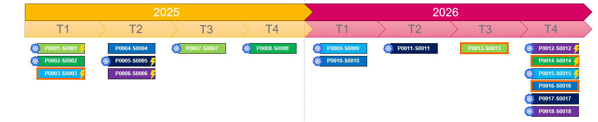

# Description

Permet de générer 1 slide powerpoint de planification au trimestre


# Prérequis

Installer python 3

# Instalation

```bash
git clone https://github.com/vincent-ledu/chronogramme-pptx.git
python -m venv .venv
.venv\Scripts\activate
pip install -r requirements.txt
```

# Utilisation

```bash
python main.py test-data.xlsx --config config.json
```

